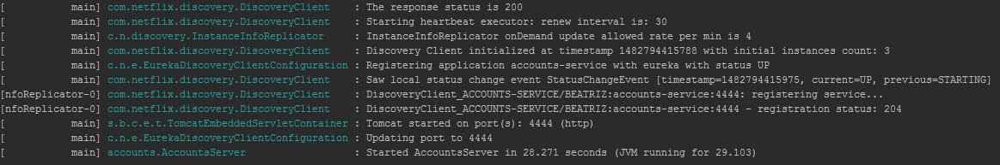

# Web Engineering 2015-2016 / Microservices
Please, go to the [Wiki](https://github.com/UNIZAR-30246-WebEngineering/lab6-microservices/wiki) in order to get the instructions for this assignment.

#### The two microservices are running and registered:

* Accounts Service running

* Web Service running

#### The service registration service has the two microservices registered:

#### A second account microservice is running in the port 4444 and it is registered:

#### A brief report describing what happens when you kill the microservice with port 2222. Can the web service provide information about the accounts? Why?

The first time when you try to find the information about accounts after kill the microservice in port 2222, the Web Service returns an error because the connection has been refused.
For that reason, the Web Service tries to discover where is Accounts Service asking to Eureka Server, so it provides the new port.  